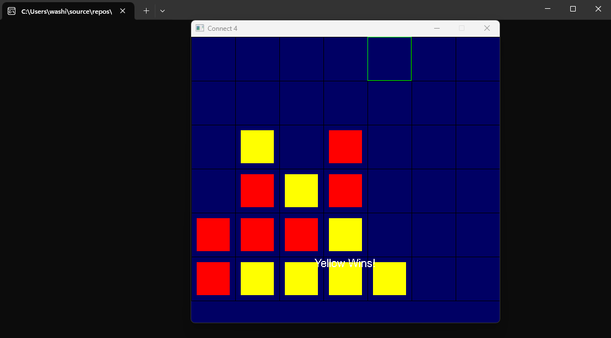

# Project 04 – Connect 4
 
## 🕹️ Description
 
This is a two-player Connect 4 game written in C++ using SDL2. The game features a graphical interface, keyboard and mouse controls, win/draw detection, and a main menu. Players alternate turns dropping red and yellow discs onto a 7×6 grid.
 
## 🎮 Controls
 
- Use left/right arrow keys to select column to drop piece in
- Press Enter or click to place a piece
- Press `R` or click "Restart" to play again
- Press 'M' to return to main menu
- Press `Esc` to exit
 
## 🧪 Screenshot
 

 
## ✨ Extra Features
 
- Grid lines for easier targeting
